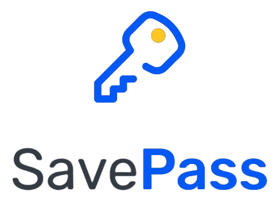

# SavePass - Gerenciador de senhas pessoais

<p align="center">

</p>

> **Nota**: Aplicação desenvolvida no desafio do curso do Ignite da Rocketseat. O qual é um aplicativo para gerenciamento de senhas, no qual você pode cadastrar as senhas de sites e serviços e quando precisar lembrar, basta acessar a aplicação e procurar pela informação cadastrada.

<br>
<br>

## :stethoscope: Tecnologias usadas
- [React Native](https://reactnative.dev/)
- [Expo](https://docs.expo.dev/)
- [TypeScript](https://www.typescriptlang.org/pt/)
- [Styled-components](https://styled-components.com/)
- [Yup](https://github.com/jquense/yup)
- [Jest](https://jestjs.io/)


## 💻 Clonando o projeto para sua máquina
1. Abra o terminal de seu computador.
2. Acessar a pasta de seus projetos. 
3. Estando dentro da pasta de seus projetos, execute os comandos abaixo:
```bash
# Para fazer o download do projeto para seu computador
$ git clone https://github.com/filipefdm/ignite-react-native-desafio04.git

# Entrar na pasta do projeto 
$ cd savepass

# Para baixar as dependências do projeto
$ npm install

# Abra com o editor vscode
$ code .
```
4. Pronto, agora basta testar e fazer as alterações que desejar.

## 🔥 Como executar o projeto em seu celular usando o expo
1. Estando dentro da pasta pelo terminal, execute o comando abaixo:
```bash
# Este comando disponibilizar o projeto para ser aberto pelo aplicativo expo que 
# você precisa de instalar em seu dispositivo físico ou no emulador. 
$ expo start
```
2. Em seguida, como o aplicativo **Expo Go** instalado em seu smartphone, basta ler o QRCode que aparece na tela do computador. 
   
<br>

> **Nota**: Seu celular e o computador devem estar na mesma rede e na mesma faixa de IP para que funcione o aplicativo entre seu computador e seu celular. 


## 📄 Licença MIT
Consulte a [LICENÇA](LICENSE) para mais informações.

---
Made with 💜 by [Filipe Motta](https://github.com/filipefdm)
